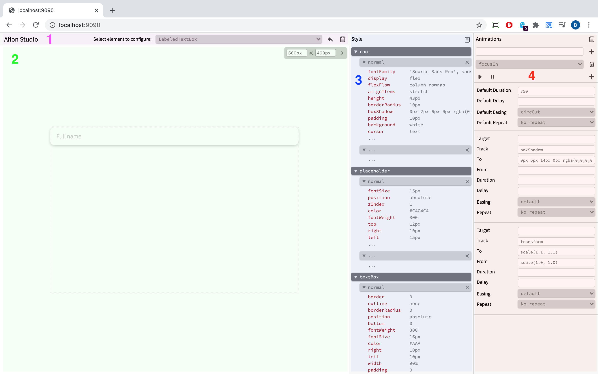

# Aflon

Aflon is strongly-typed object-oriented old-school UI framework for web.

Compared to functional/declarative UI frameworks (React, Angular), Aflon is based on **stateful** components and extensive use of inheritance and encapsulation.

Aflon ships with built-in support for styling and animation, as well as web application [Aflon Studio](https://bognikol.github.io/aflonsample/aflonStudio), where every Aflon component can be independently isolated for testing and styling.

## The Table of the Contents

- Quick Start
- Motivation
- Tutorial
    - Building UI Tree
    - Creating Custom Components and Running Application
    - Eventing Infrastructure
    - Styling Components
    - Defining and Running Animations
    - Complete Tutorial Example
    - Using Aflon Studio
- Structure of Repository & Build Instructions

## Quick Start

The easiest way to create Aflon application is to download [aflon-bootstrap](projects/aflon-bootstrap) application and modify it. Preview running aflon-bootstrap application [here](https://bognikol.github.io/aflonsample).

For those who already have project and infrastructure in place, following steps are short walkthrough for including Aflon.

First install Aflon:

```sh
npm install --save aflon
```

and then modify your entry-point file as following:

```TypeScript
import { App, Div } from "aflon";

App.run(new Div().setText("Hello world!"));
```

Code above is a valid Aflon program.

Instead of configuring inline `Div` component, we can define `HelloWorld` component which by default contains "Hello world" text. If we want to style `HelloWorld`, we can set static `HelloWorld.style` to appropriate `AflonCss` object.

```TypeScript
import { App, Div } from "aflon";

class HelloWorld extends Div {
    constructor() {
        super();
        this.setText("Hello world!");
    }
}

HelloWorld.style = {
    _: {
        fontSize: "20px",
        margin: "10px",
        color: "red"
    }
};

App.run(new HelloWorld());
```

View Tutorial for more details.

## Motivation

(This section contains only theoretical considerations.)

From my experience, representing UI component as an object in object-oriented program is the simplest and the most efficient way of working with UI. This is old heuristic in UI development which had peek of popularity as object-oriented paradigm became widespread during late 90s. WinForms, although old and limited, is an example of such framework.

However, in further development, under influence of HTML, UI frameworks pivoted more toward declarative UI languages, as it was believed that structure of UI should be *described* rather then *constructed* in code. An example of such approach is WPF, which, still object-oriented, made huge effort to integrate declarative description of UI through XAML. This was done at the major cost: XAML became extremely verbose while integration between XAML and code behind introduced its own complexities which, in my opinion, exceeded benefits of XAML. However, this philosophy, if relentlessly practiced, together with astonishing infrastructure offered by Visual Studio, enabled segregation of logic and appearance of UI components.

Modern popular Web UI frameworks, like React and Angular, continued to evolve descriptive heuristic. However, rather then being object-oriented, they pivoted toward functional programming, trying to model UI as a map of some state, automatically updating UI as state changes. Components fundamentally became stateless, acting as pure functions which transform the state to UI. While this is a noble idea, it didn't come without cost: once the component needs to cache anything, the beautiful elegant formalism of pure functions becomes polluted with workarounds.

The major drawback of React components, for example, is that they do not offer its state to be examined on demand by parent component (this is inevitable by design). This way, if parent component is interested in knowing what is the current text in child component, it needs to subscribe to events and track every change of text, while text itself is essentially duplicated both in child and parent component. Therefore, instead of encapsulating complexity within themselves, React components often overflow complexity toward parent components.

One of the approaches to the problem of duplicated state was to model whole UI application as a state machine. I believe this is a rather impractical approach - global state of UI application is extremely large and *public*, so hiding of internal implementations of components is rather impossible because *component-specific* fields are still exposed *publicly* in the state. That way global state becomes global cacophony of voices of every single component in the application.

Although there is always a state behind any UI (we can always implicitly calculate it), I find that it is usual more practical to consider UI as a control table which is created by wiring up smaller control devices in meaningful manner. The reason for this is that in later case interfaces between components are slimmer and encapsulation is stronger, which immediately yields lower complexity and higher modularity. (This not always more practical though - for example in situation where application is used to build up some kind of document (eg. MS Word), it can be very useful to understand UI as a map of state.)

Object-oriented programming allows us to model a component as a class; it can populate itself with children nodes in constructor; it can inherit generic component which gives common functionality (or any other existing component class which can be specialized); it can expose public methods; and it can raise and subscribe to events.

Inspired by old-school UI frameworks like WinForms, I wanted to see how JavaScript DOM API can be adapted to object-oriented framework, with inheritance as main mechanism for tailoring components. I also wanted to restrict the framework to pure TypeScript (JavaScript), avoid declarative syntax and compiler infrastructure which goes with it, but preserve hierarchical representation of UI **in code** (just like HTML represents UI as tree); also, I wanted to closely couple component with its style **in the same file**, so time for searching for appropriate style during development is minimized.

## Tutorial

### Building UI Tree

Aflon, in essence, is a very slim wrapper around JavaScript DOM API. Basic construct which represents an HTML node is abstract class `aflon.Element`. It contains a reference to a single `HTMLElement` which it represents, and offers a wide range of common functions for managing it. In general, DOM API should not be visible behind Aflon type system; Aflon type system is intended to represent complete abstraction of DOM API. However, `HTMLElement` can be accessed through `aflon.Element.getHtmlElement()` function for native operations.

All other HTML elements are modeled as classes inheriting `aflon.Element`, overriding the tag name of HTML node and optionally extending its functionality. Classes `Div`, `Span`, `P`, `H1`, `H2`, `H3`, `H4`, `H5`, `H6`, `Image` all represent appropriate HTML elements. Apart from these classes, Aflon also exposes basic input types. These types inherit abstract class `aflon.Input` which in turn inherits `aflon.Element`. Basic input classes in Aflon are `TextBox`, `PassBox`, `TextArea`, `Button`, `CheckBox`, `RadioButton` and `SelectBox`. All of these classes represent unique HTML elements. Developers can easily create their own classes.

Aflon components contain methods, of which some are setters and getters. Setters and getters are always functions; Aflon does not use ECMAScript properties. Setters in general start with 'set' word, and getters with 'get' word. **Every setter by convention returns `this`.** This convention is important because it allows compact configuration of an object in code. This pattern is known as [chaining](https://en.wikipedia.org/wiki/Method_chaining). (Developers should stick to this convention when implementing their own types extended from `aflon.Element`.) For example, if we want to create `<input type="button" />` which contains text "Hello world", has class "innerButton", and reacts on click event, we can write something like this:

```TypeScript
new Button()
    .setText("Hello world")
    .addClass("innerButton")
    .on("click", () => alert("Checked!"));
```

Furthermore, if we want to create red `Div` which contains previous button, we can do it like this:

```TypeScript
new Div()
    .setInlineCss({ background: "red" })
    .append([
        new Button()
            .setText("Hello world")
            .addClass("innerButton")
            .on("click", () => alert("Checked!"))
    ]);
```

Using chaining we can create hierarchical representation of UI in TypeScript code without using declarative languages. This code creates DOM tree equivalent to following HTML snippet:

```html
<div 
    style="background: red">
    <input 
        type="button" 
        class="innerButton" 
        onclick="alert('Checked!')" 
        value="Hello world">
</div>
```

### Creating Custom Components and Running Application

We can take previously configured red div and make it a custom component - let's call it `CheckButton`. Custom components are created by extending existing components. Because `CheckButton` is essentially a red div, we will extend `aflon.Div` class, and configure it in the constructor:

```TypeScript
class CheckButton extends Div {
    constructor() {
        super();
        
        this
            .setInlineCss({ background: "red" })
            .append([
                new Button()
                    .setText("Hello world")
                    .addClass("innerButton")
                    .on("click", () => alert("Checked!"))
            ]);
    }
}
```

Now we can introduce private (or protected) field which would hold reference to button, so we can easily reference it in code, and add public method to `CheckButton` for changing the button textual content. Note that `setText()` and `getText()` methods are virtual methods inherited from `aflon.Element`.

```TypeScript
class CheckButton extends Div {

    private innerButton: Button;
    
    constructor() {
        super();
        
        this
            .setInlineCss({ background: "red" })
            .append([
                (this.innerButton = new Button())
                    .setText("Hello world")
                    .addClass("innerButton")
                    .on("click", () => this.onInnerButtonClick())
            ]);
    }
    
    onInnerButtonClick(): void {
        alert("Checked!");
        this.setInlineCss({ background: "green" });
    }

    setText(text: string): this {
        this.innerButton.setText(text);
        return this;
    }

    getText(): string {
        return this.innerButton.getText();
    }
}
```

We can now instantiate `CheckButton` by calling its constructor. Let's say that we want to create new custom component called `MultyCheck` which is consisted of 5 `CheckButton`s:

```TypeScript
class MultyCheck extends Div {
    constructor() {
        super();
        
        this.append([
            new CheckButton().setText("Michael"),
            new CheckButton().setText("Steve"),
            new CheckButton().setText("Bill"),
            new CheckButton().setText("Joe"),
            new CheckButton().setText("Alfred")
        ]);
    }
}
```

Let's say that `MultyCheck` is our application. Aflon has class `App` which is used for starting the application:

```TypeScript
aflon.App.run(new MultyCheck());
```

### Eventing Infrastructure

Aflon tries to offer eventing mechanism which: (1) seamlessly extend and fit into native HTML eventing infrastructure, and (2) use TypeScript's type system to offer strongly typed event handling experience for the developer.

It the nutshell, Aflon eventing mechanism is implemented through 3 methods of `aflon.Element`: `on`, `off` and `raise`. These three methods are part of `IEventable` interface which `aflon.Element` implements.

`on` and `off` methods simply add or remove event handlers for specific string-identified event which are raised by underlying `HTMLElement`. Event handlers receive native event arguments from the eventing system (whose type depends on the type of event handled) with a single difference - property `target` (which contains reference to background native `HTMLElement` which raised the event) contains property `aflonElement` - a reference to an Aflon counterpart of native element. For example:

```TypeScript
class CheckButton extends Div {
    private innerButton: Button;

    constructor() {
        super();
        
        this
            .setInlineCss({ background: "red" })
            .append([
                (this.innerButton = new Button())
                    ...
                    .on("click", e => this.onInnerButtonClick(e))
            ]);
    }
    
    onInnerButtonClick(e): void {
        alert(e.target.aflonElement.getText());
        this.setInlineCss({ background: "green" });
    }
    ...
}
```

Note though that `aflonElement` is not present if the origin of the event is `HTMLElement` which is not created through Aflon, e.g. does not have corresponding `aflon.Element`.

`raise` method, on the other hand, use native HTML eventing infrastructure to raise a string-identified event with custom event data; events raised this way can be handled even using `addEventListener` and `removeEventListener` methods. `raise` by default raises a non-bubbling event, but this can be configured. For example, if we want to raise custom event `checked` at the moment when our `CheckButton` component becomes green, we can modify `onInnerButtonClick` in the following way:

```TypeScript
class CheckButton extends Div {
    private innerButton: Button;
    
    constructor() {
        super();
        
        this
            .setInlineCss({ background: "red" })
            .append([
                (this.innerButton = new Button())
                    ...
                    .on("click", this.onInnerButtonClick)
            ]);
    }
    
    onInnerButtonClick = (e) => {
        this.setInlineCss({ background: "green" });
        (e.target.aflonElement as AflonElement).off("click", this.onInnerButtonClick);
        this.raise("checked");
    }
    ...
}
```

`checked` event does not contain any particular additional data, only default event argument which native eventing system generated. This argument also has `target.aflonElement` property which contains a reference to `CheckButton` which raised the event. Note that we also unsubscribed `onInnerButtonClick` from `click` event. We also changed how we declared `onInnerButtonClick` in order to be able to unsubscribe it (view JavaScript context binding rules for method declarations).

However, once we added `checked` event to `CheckButton` (it became a part of its interface actually), how we can enable strong typing in situations when we are working with `CheckButton`'s instance or even subclass. There is no elegant way to do that because JavaScript (TypeScript) does not consider event to be a first-class object (as opposed to .NET languages for example). Therefore, in order to make events a part of an interface, for each event we are adding a string variable to the interface which is called `event<actualEventName>` and which contains event name. `aflon.Element` for example contains about 30 most popular events applicable to generic `HTMLElement`; all its descendants contain them as well. However, **aflon.Element can handle any arbitrary event**; event name does not need to be a member of a component in order component to work with it. Furthermore, `aflon.Input`, which is a subclass of `aflon.Element` inherits all `aflon.Element` events but adds two more, input-specific events: `change` and `input`. To illustrate this, consider following code snippet:

```TypeScript
interface ICheckable extends IEventable {
    public eventChecked;
}

class CheckButton extends Div implements ICheckable {
    public eventChecked = "checked";
    ...
    constructor() {
        this
            .append([
                (this.innerButton = new Button())
                    ...
                    .on(this.innerButton.eventClick, this.onInnerButtonClick)
            ]);
    }
    
    onInnerButtonClick = () => {
        ...
        this.innerButton.off(this.innerButton.eventClick, this.onInnerButtonClick);
        this.raise(this.eventChecked);
    }
    ...
}

let someCheckable: ICheckable = new CheckButton();
someCheckable.on(someCheckable.eventChecked, () => alert("Some checkable is checked!"));
```

### Styling Components

Aflon does not demand any particular styling strategy.

However, according to its philosophy **Everything in TypeScript**, Aflon offers infrastructure for type-safe definitions of CSS rules (and in particular classes) in TypeScript code using object literals. Main type used for definition of CSS style in Aflon is `CSSProperties`, which is a type reexposed from Aflon's dependency library [typestyle](https://typestyle.github.io/). For more information view [typestyle documentation](https://typestyle.github.io/#/core). Example of defining CSS rule in-code in Aflon is as following:

```TypeScript
import { CSS } from "aflon";

CSS.createRule("html, body", {
    width: "100%", height: "100%", margin: 0, padding: 0
});
```

Furthermore, as a component is the fundamental building block of Aflon applications, Aflon presumes that every component type should be coupled with unique style (which can later be redefined). In order to enable it in TypeScript, following object-oriented approach, every Aflon component has static field `style` which contains style information for that particular component.

Static `style` field (of type `AflonCss`) is essentially a string dictionary of `CSSProperties` (eg. `Record<string, CSSProperties>`). If component class has field `this.something` which contains a reference to its child, then the key `something` in style record configures CSS of that child. Key `_` (underscore) configures CSS of the component itself. For example:

```TypeScript
class SomeComponent extends aflon.Div {
    private element1: aflon:Div;
    private element2: aflon.Div;
    private element3: aflon.Div;
    
    constructor() {
        ...
    }
    ...
}

SomeComponenet.style = {
    _: {
        background: "red", // configures CSS of SomeComponent root
    },
    element1: { ... }, // configures CSS of element1
    element2: { ... }, // configures CSS of element2
    element3: { ... }  // ...
};

```

This way class definitions do not need to contain any reference to styling, fundamentally decoupling **appearance** from **structure and behavior**. However, these two can never be completely decoupled (because behavior of component might be to change its style). Therefore, for absolute decoupling, concept of CSS transitions need to be introduced, which is in Aflon done through Animations.

#### Examples

Let's consider some practical examples. Suppose that we have following CSS class rules defined somewhere:

```CSS
.innerButton {
    font-size: 20px;
    font-weight: bold;
    margin: 10px;
}

.checkButton {
    background: red;
    display: inline-block;
    margin: 10px;
}
```

Now we have already added `innerButton` to `this.innerButton` so we only need to add `CheckButton` to `this`:

```TypeScript
class CheckButton extends Div {

    private innerButton: Button;
    
    constructor() {
        super();
        
        this
            .addClass("checkButton")
            .append([
                (this.innerButton = new Button())
                    .setText("Hello world")
                    .addClass("innerButton")
                    .on(this.innerButton.eventClick, () => this.onInnerButtonClick())
            ]);
    }
    
    ...
}
```

However, Aflon's attitude is to use TypeScript only; therefore we can use simple mechanism for in-code definition of CSS classes. This functionality is based on typestyle library, which does not only generates class rules but offers strongly-typed environment for defining these rules. Previous CSS code can be equivalently defined in following manner:

```TypeScript
const innerButtonClass = CSS.class({
    fontSize: "20px",
    fontWeight: "bold",
    margin: "10px"
});

const checkButtonClass = CSS.class({
    background: "red",
    display: "inline-block",
    margin: "10px"
});

class CheckButton extends Div {

    private innerButton: Button;
    
    constructor() {
        super();
        
        this
            .addClass(checkButtonClass)
            .append([
                (this.innerButton = new Button())
                    .setText("Hello world")
                    .addClass(innerButtonClass)
                    .on(this.innerButton.eventClick, () => this.onInnerButtonClick())
            ]);
    }
    
    ...
}
```

Note that `innerButtonClass` and `checkButtonClass` are not names of CSS classes but variables that contain names. `aflon.CSS.class` returns the name of generated class which is a hash of style object. For more information view documentation of typestyle and its dependencies.

In any case, we can notice that we have already given name to our button - `this.innerButton` - and to our root CheckButton div - as `class CheckButton`. Therefore exposing name of default CSS class for any element introduce redundancy and noise.

In order to simplify styling of complex components, we can use static `style` field of type `AflonCss` which represents default style of the component. This style can be overriden before any instance of component is created. Therefore, instead of creating a class and then adding class name to component, we only specify `style` field while rest is done in background. Following code is equivalent to previous snippets:

```TypeScript
class CheckButton extends Div {

    private innerButton: Button;
    
    constructor() {
        super();
        
        this
            .append([
                (this.innerButton = new Button())
                ...
            ]);
    }
    
    ...
}

CheckButton.style = {
    _: {
        background: "red",
        display: "inline-block",
        margin: "10px"
    },
    innerButton: {
        fontSize: "20px",
        fontWeight: "bold",
        margin: "10px"
    }
};

```

### Defining and Running Animations

There are several ways to define and run animations in Aflon. The simplest way is to use `aflon.animate` or `aflon.animateAsync` functions. Both functions are essentially the same except `aflon.animateAsync` returns promise which is resolved when animation finishes. It takes two arguments: `element`, which is an `aflon.Element` upon which animation will be executed, and `definition` which is a `aflon.PrimitiveAnimationDefinition` which specifies how animation will look like. When `animate` is called, animation is started immediately. For example, if we want to make element fade out on click, we can use following code:

```TypeScript
import { Div, animate } from "aflon";

let elem;

(elem = new Div())
    .setText("Hello world")
    .on(elem.eventClick, () => animate(elem, { track: "opacity", to: "0.0" }));
```

`aflon.PrimitiveAnimationDefinition` is a data structure which stores information about how animation should look like. In Aflon terminology, 'primitive' animation means that only single CSS parameter (which is called `track`) is animated. Apart from other parameters, it contains following:

- `track` - specifies which CSS property should be animated; mandatory;
- `to` - specifies end value of animation; mandatory;
- `from` - specifies start value of animation; if not specified current value of CSS property will be used;
- `target` - specifies the name of child upon which animation should execute; if not specified animation will be executed upon the element itself;
- `ease` - easing function for animation; default is linear. This property can have value of either one of predefined string constants which specify easing function, or the function which maps interval [0, 1] to [0, 1];
- `duration` - duration of animation; default value is 300 milliseconds;
- `delay` - specifies delay between calling start function and actual start of animation, default value is 0;
- `elapsed` - specifies point on animation timeline from which animation should start when start function is called;

Drawback of using `aflon.animate` function is that animation cannot be controlled. Aflon offers `aflon.Animation` class which can be used to control animation playback. Also, `aflon.Animation` class supports complex animation, which are animations that change multiple CSS properties independantly. For example, we can create following animation:

```TypeScript
import { Div, Animation } from "aflon";

class AnimElement extends Div {

    private elem: Div;
    private anim: Animation;

    constructor() {
        super();

        this.append([
            (this.elem = new Div())
                .on(this.elem.eventClick, () => onClick())
        ]);

        this.anim = new Animation({
            ease: "circOut", 
            animations: [
                { track: "fontSize", to: "20", duration: "2000" },
                { track: "color", to: "#F00", delay: "1000" }
            ]
        }, this.elem);
    }

    onClick() {
        this.anim.start();
    }
}
```

`aflon.Animation` constructor use `aflon.AnimationDefinition` instead of `aflon.PrimitiveAnimationDefinition`. `aflon.AnimationDefinition` contains field `animations`, which is an array of `aflon.PrimitiveAnimationDefinition`s, each of which specifies animation of single CSS property. Apart from `animations` field, it contains all optional fields of `PrimitiveAnimationDefinition`; these values act as fallback values if separate animations haven't specified them. If fallback values are not specified, default values are used.

`aflon.animation` object contains following methods:

- `start()` - restarts the animation; accepts optional callback function which is called when animation finishes;
- `startAsync()` - same as `start` except that it returns promise which is resolved when animation finishes;
- `stop()` - stops the running animation;
- `toBegining()` - sets all animated properties to start values;
- `toEnd()` - sets all animated properties to end values;
- `getElapsed()` - returns number of milliseconds which ellapsed since starting the animation;
- `getProgress()` - returnes number between 0 and 1 which indicates progress of animation since start.

However, in order to avoid initializations of multiple `Animation` objects in code, Aflon offers fuincionality of setting animation definitions to static field `animations` of `aflon.Element`. This variable is equvalent to static variable `style`; it can be overriden before any instance of component is created. Type of `animations` field is `AflonAnimation`, which is essentially a string dictionary where keys represent names of animations and values are objects representing `AnimationDefinition`s. During construction, these definitions are converted to `Animation` objects which can be accessed using `aflon.Element.animations` function while passing the name of animation as input agument. **Each animation definition from `AflonAnimation` is converted to exactly one object which is persisted during multiple accesses.** This enables developer to stop animation or check its progress. Previous example can be rewritten in following manner:

```TypeScript
import { Div, Animation } from "aflon";

class AnimElement extends Div {

    private elem: Div;

    constructor() {
        super();

        this.append([
            (this.elem = new Div())
                .on(this.elem.eventClick, () => onClick())
        ]);
    }

    onClick() {
        this.animations("anim").start();
    }
}

AnimElement.animations = {
    anim: {
        ease: "circOut",
        target: "elem",
        animations: [
            { track: "fontSize", to: "20", duration: "2000" },
            { track: "color", to: "#F00", delay: "1000" }
        ]
    }
};
```

### Complete Tutorial Example

Following code snippet represents complete example developed in this tutorial:

```TypeScript
import { Div, Button, App, Input, CheckBox, AbstractToggableButton } from "aflon";
    
class CheckButton extends Input implements AbstractToggableButton {

    private checked: boolean = false;

    private innerButton: Button;

    public eventChecked = "checked";

    constructor() {
        super();
        
        this
            .setInlineCss({ background: "red" })
            .append([
                (this.innerButton = new Button())
                    .on(this.innerButton.eventClick, () => this.onInnerButtonClick())
            ]);
    }
    
    onInnerButtonClick() {
        this.setChecked(!this.checked);
    }

    setChecked(checked: boolean): this {
        if (this.checked == checked) return this;

        if (this.checked) {
            this.animations("uncheck").start();
            this.checked = false;
        } else {
            this.animations("check").start();
            this.checked = true;
        }

        this.raise(this.eventChecked);

        return this;
    }

    getChecked(): boolean {
        return this.checked;
    }

    setText(text: string): this {
        this.innerButton.setText(text);
        return this;
    }

    getText(): string {
        return this.innerButton.getText();
    }

    setDisabled(disabled: boolean): this {
        this.innerButton.setDisabled(disabled);
        return this;
    }

    getDisabled(): boolean {
        return this.innerButton.getDisabled();
    }

    focus(): this {
        this.innerButton.focus();
        return this;
    }

    blur(): this {
        this.innerButton.blur();
        return this;
    }
}

CheckButton.style = {
    _: {
        background: "red",
        display: "inline-block",
        margin: "10px"
    },
    innerButton: {
        fontSize: "20px",
        fontWeight: "bold",
        margin: "10px"
    }
};

CheckButton.animations = {
    check: {
        ease: "circOut",
        duration: 200,
        animations: [
            { track: "background", to: "#0F0" },
            { track: "margin", target: "innerButton", to: "5px" }
        ]
    },
    uncheck: {
        ease: "circOut",
        duration: 200,
        animations: [
            { track: "background", to: "#F00" },
            { track: "margin", target: "innerButton", to: "10px" }
        ]
    }
};
    
class MultyCheck<T extends AbstractToggableButton> extends Div {

    private checks;

    constructor(private Type: new () => T) {
        super();
        
        this.checks = ["Michael", "Steve", "Bill", "Joe", "Alfred"].map(name => 
            new Type()
                .setText(name)
                .on("checked", () => this.onChecked())
        );

        this.append(this.checks);
    }

    onChecked() {
        let result = "";

        this.checks.forEach(check => {
            if (check.getChecked())
                result += check.getText();
        });

        console.log(result);
    }
}

App.run(new MultyCheck<CheckButton>(CheckButton));
```

### Using Aflon Studio

Aflon Studio is a browser app intended to be used during development of Aflon applications. Aflon Studio allows developer to independently test and style Aflon componenets. View [here](https://bognikol.github.io/aflonsample/aflonStudio) how aflon-studio looks like.

Aflon Studio is not part of `aflon` library; it is packed in its own stand-alone library `aflon-studio`. Usage of Aflon Studio is fully optional. In any case, Aflon Studio is installed in following manner:

```sh
npm install --save-dev aflon-studio
```

Once installed, Aflon Studio needs separate entry point and separate compilation target. `aflon-bootstrap` application already has Aflon Studio configured. Examine it to see details. In following text we will first give short overview of Aflon Studio and then we will explain how it is used.



Picture above is a screenshot of Aflon Studio and shows its main UI componenets:

1. Header panel is used to choose what componenet is to be selected for preview and configuration.

2. Preview panel is where Aflon components are shown. These components are fully interactive; they react to mouse and other input events.

3. Style panel is used to configure component's static `style` property. All changes are reflected in Preview panel in real-time. Note, however, that Style panel does not change your code! You still need to copy your style object (by clicking the copy button on the top of Style panel), paste it in code and recompile. Style panel is organized in accordance to structure of AflonCss object. First it is devided to component selectors: selector `root` means that css confguration bellow is applied to the componenet container itself. Apart from it, for each field in componenet which has reference to some `aflon.Element` separate selector section is created. Within each componenet selector section, there is a list of pseudo-selectors. These pseudo-selectors are equivalent ot CSS pseudoselectors, except `normal` which deisgnates default CSS style of a component. Each pseudoselector section contins list of key-value pairs of CSS properties.

4. Animation panel is used to configure componenet's static `animations` property. All changes are reflected in Preview panel in real-time. Animations can run using multimedia controls on the top of the Animation panel. Similar to Style panel, Animation panel does not change you code! You still need to copy yout animation object (by clicking the copy button on the top of Animation panel), paste it in code and recompile.

The best way to start using Aflon Studio is to load existing component in it. To do so you need to register component to be shown in Aflon Studio and to import whole file where componenet is registered to Aflon Studio entry-point file. For example, if we want to preview CheckButton componenet, we need to modify file where CheckButton is defined in following manner:

```TypeScript
// file CheckButton.ts

import { Div } from "aflon";
import AflonStudio from "aflon-studio";

class CheckButton extends Div {
    ...
}

CheckButton.style = { ... };
CheckButton.animations = { ... };

AflonStudio.register({
    class: CheckButton,
    initializer: element => {
        element.setChecked(true)
    },
    viewportSize: {
        width: "200px",
        height: "50%"
    }
    backgroundColor: "lightgray"
});
```

Function `AflonStudio.register` is used to reguster component for previewing in Aflon Studio. It takes object with following properties:

- `class` - specifies components class; mandatory;
- `initializer` - specifies function to be executed immidiatelly after construction of component; this function does custom initialization of the component; optional;
- `viewportSize` - specifies size of parent (in Preview panel) where component will be inserted; contains two fields `width` and `height` of which each can be set to either exact values or percetage; this is used to see how componenet behaves in different size contexts; optional;
- `backgroundColor` - specifies color of Preview panel; optional.

Once `AflonStudio.register` is called, whole file should be imported to Aflon Studio entry point:

```TypeScript
import "CheckButton.ts";

import AflonStudio from "aflon-studio";

AflonStudio.run();
```

## Structure of Repository & Build Instructions

This repository contains three interdependent npm projects: aflon, aflon-studio and aflon-bootstrap. All projects are located in ./projects directory.

This repository uses [rush](https://rushjs.io/) as a multiproject manager for npm projects. Rush manages dependencies of projects in unified way, track changes and builds projects in coordinated way. Before installing rush, you need [NodeJS](https://nodejs.org/en/) installed. Install rush by running following command in your terminal:

```sh
npm install -g @microsoft/rush
```

To install dependencies navigate to aflonstack root and run:

```sh
rush update
```

To build all projects, run:

```sh
rush build
```

To clear all temporary files run:

```sh
rush purge
```
